# Admin User Guide

### 1. Introduction

This platform is designed to support administrators in collecting and analysing user feedback through structured, guided interactions. It enables the creation of issues, gathers participant responses, and transforms raw input into meaningful insights.

The system is particularly useful for understanding user perspectives on specific topics, identifying patterns in feedback, and supporting data-driven decision-making.

### 2. Key Features Overview

The platform provides three main functionalities for administrators:

- #### Issue Creation

Administrators can create and publish issues that will be presented to users. Each issue serves as the starting point for user reflection and response collection.

- #### Response Monitoring and AI Analysis

The system collects user responses to guided questions and displays them in an organised format. Administrators can review individual answers or aggregated results.
In addition, an integrated AI module helps summarise user responses, making it easier to identify key themes and insights without manually analysing all data.

- #### Participant Engagement (Email & Coupons)

Administrators can send emails to participants, including incentives such as discount coupons. This feature helps improve participation rates and user engagement.

### 3. Login

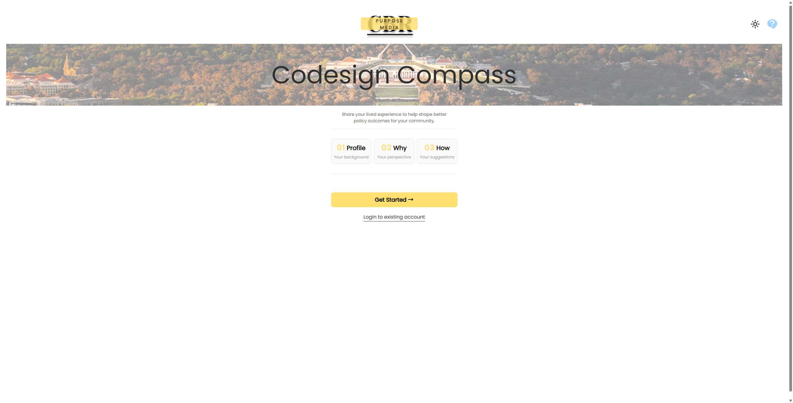

By clicking the "Login to existing account" button to login page.

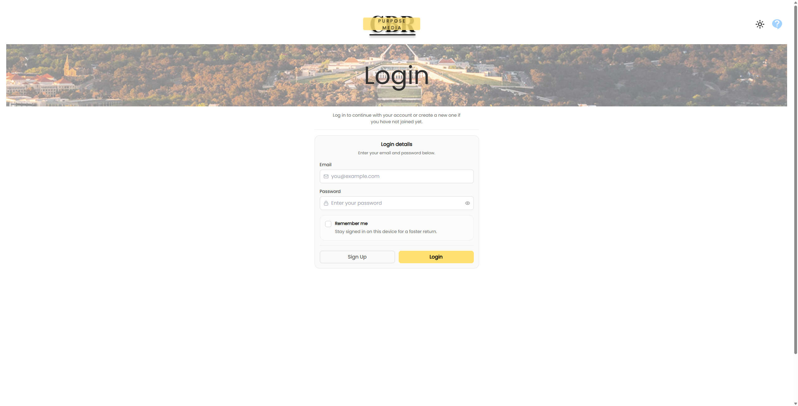

Current Email: compass@purposemediacbr.au

Current Password: Heidi123\*

### 4. Create New Issues

After login, you can create an issue by clicking the "New Issue" button.

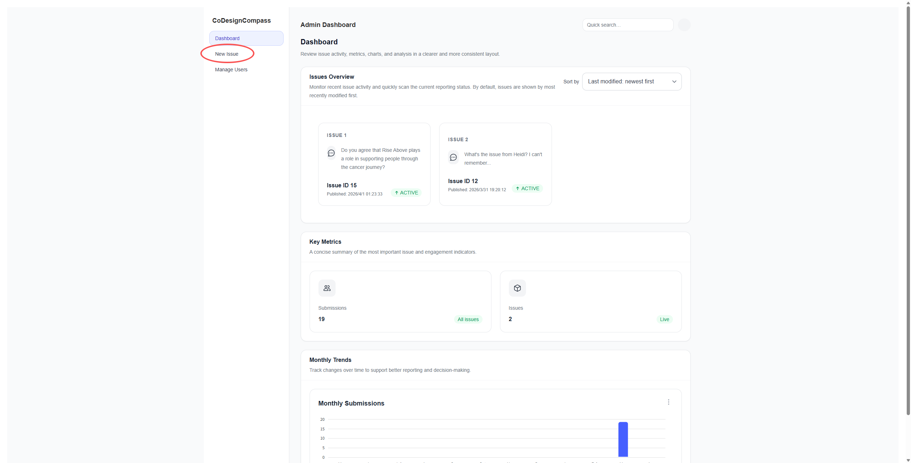

Enter the issue you want to ask and click the "Publish Issue" button. Then the new issue will be published to the public and generate a share link which people is gonna to use to answer the questions.

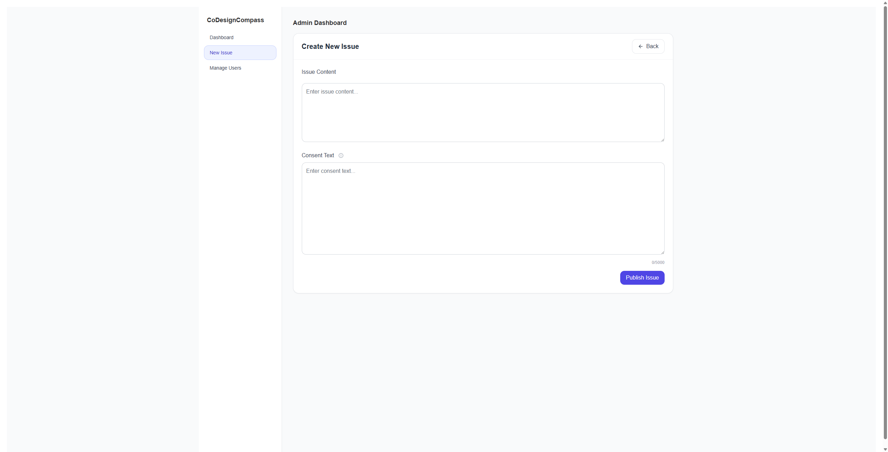

### 5. Viewing Responses

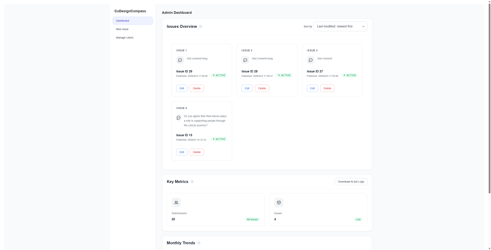

By clicking certain issue card, you can view all the data related to it, like answering trend, word cloud and AI summary.

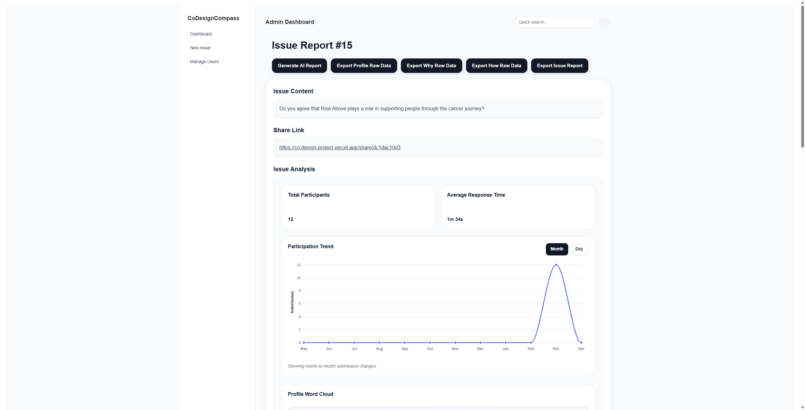

Word Cloud:

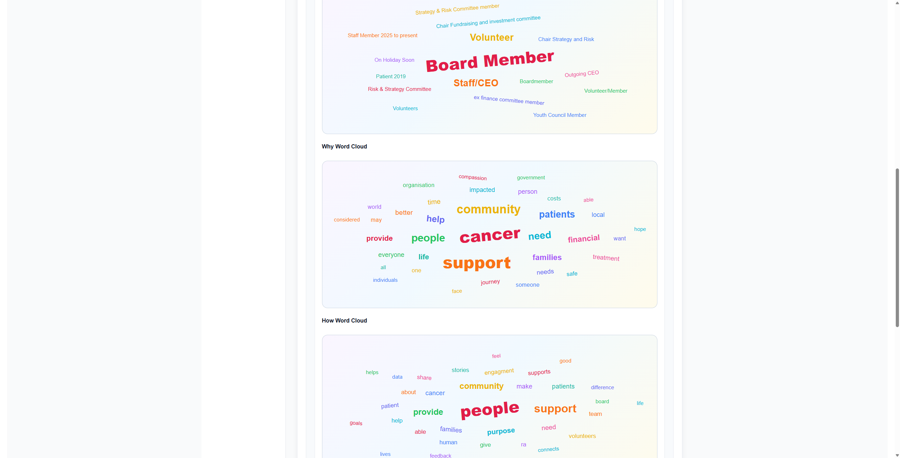

AI Summary:

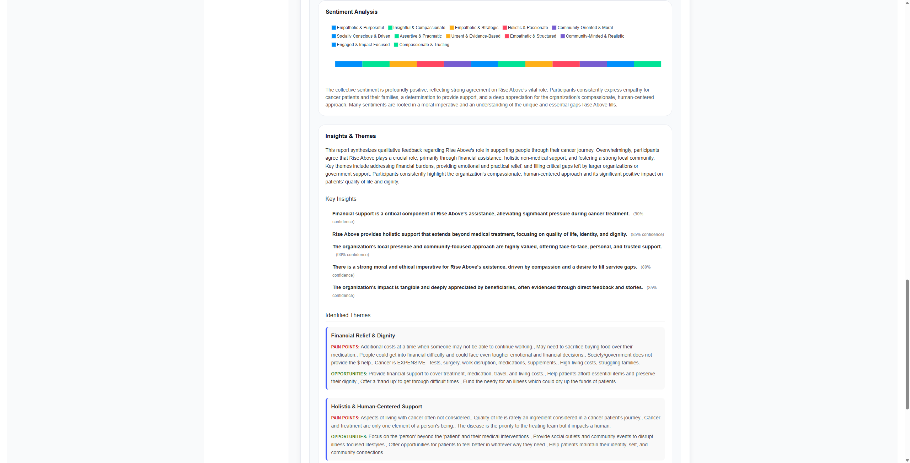

Also you can export raw data and final report if you want.

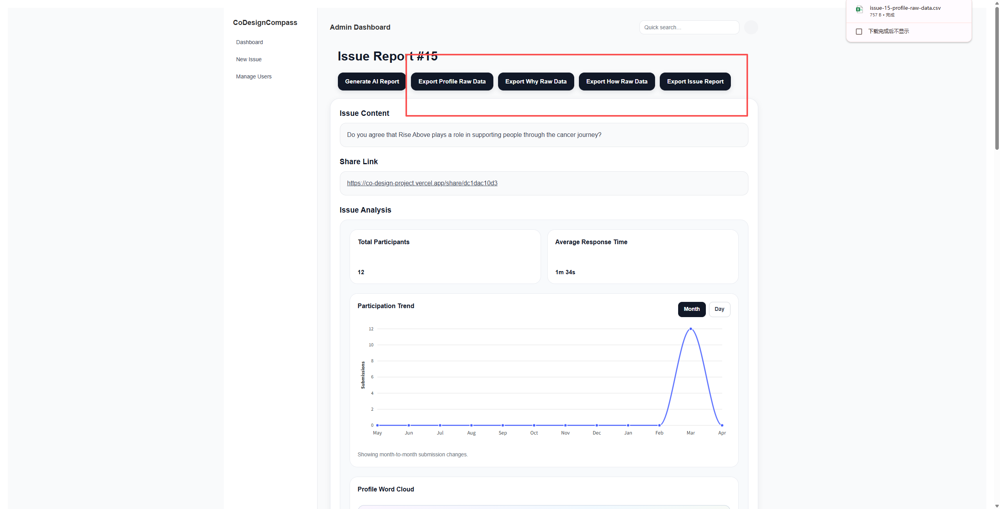

### 6. Managing Users

In this page you can send coupons to users who provided a valid email address.

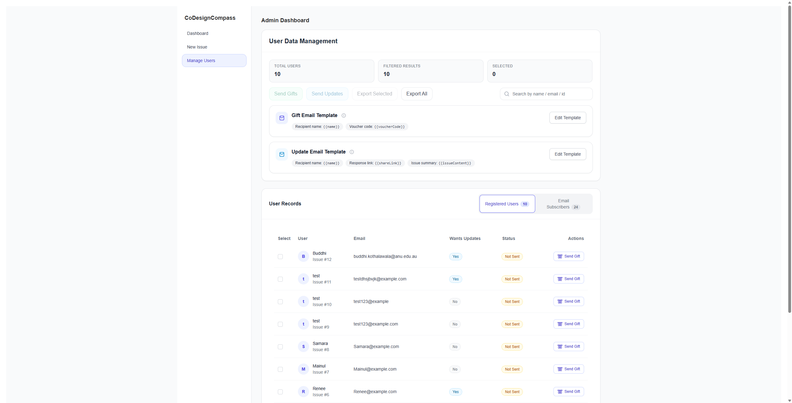

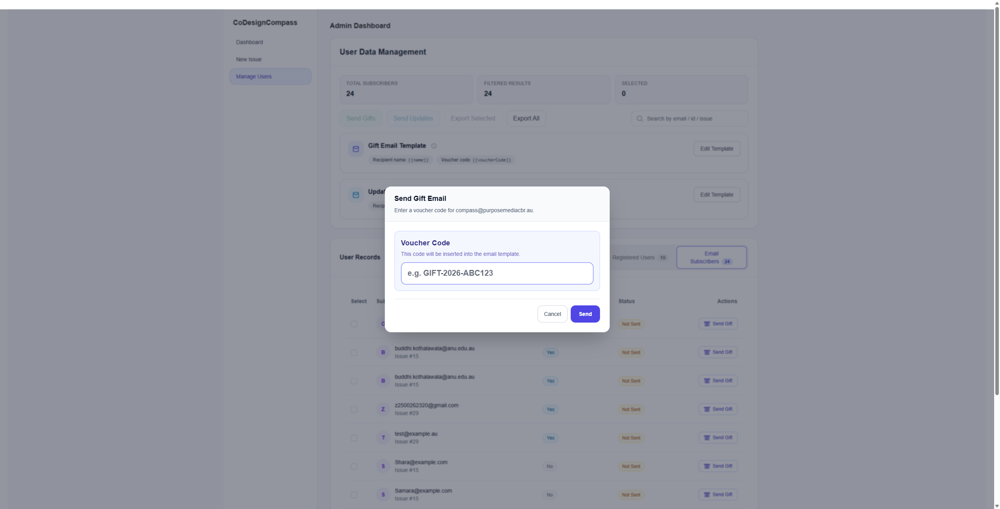

You can click the "Email Subscribers" button to see people who only subscribed but not registered.

You can choose either send them one by one or in a batch.

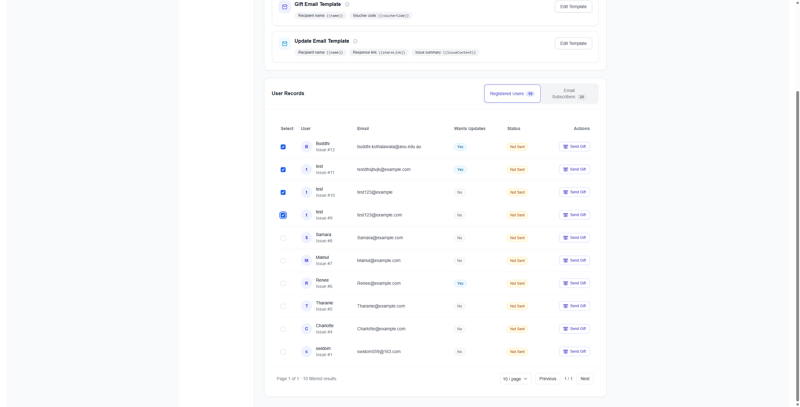

## 7. Conclusion

The platform enables administrators to efficiently manage issues, analyse user feedback, and gain insights through AI support, while ensuring that user responses remain unbiased and authentic.
