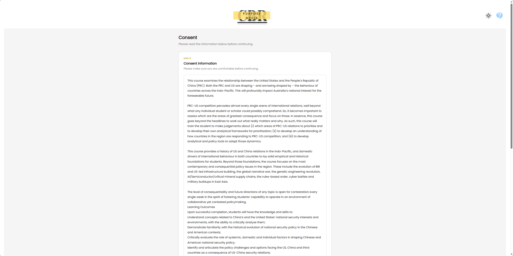
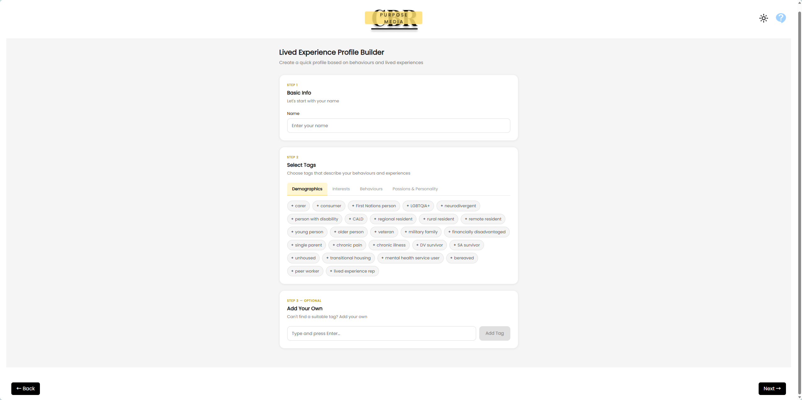
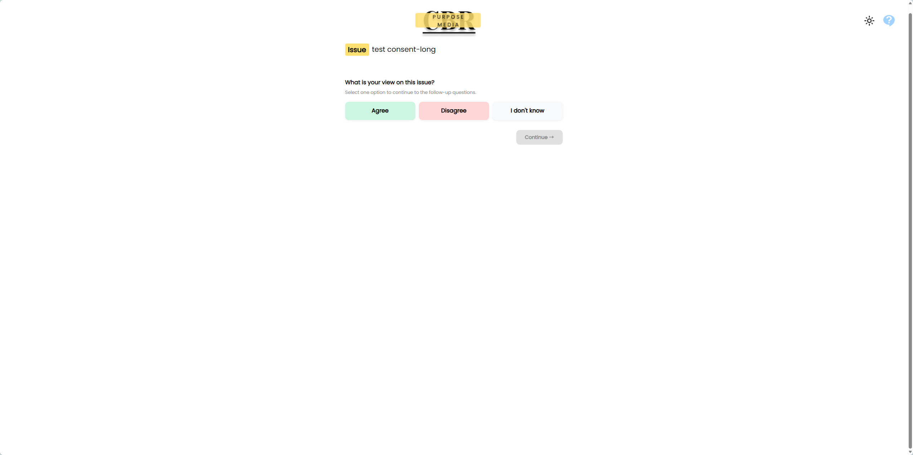
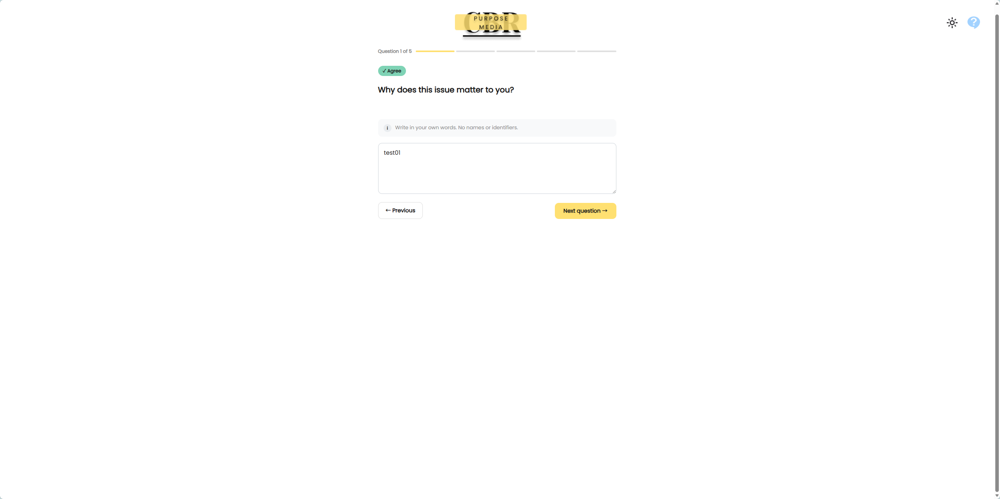
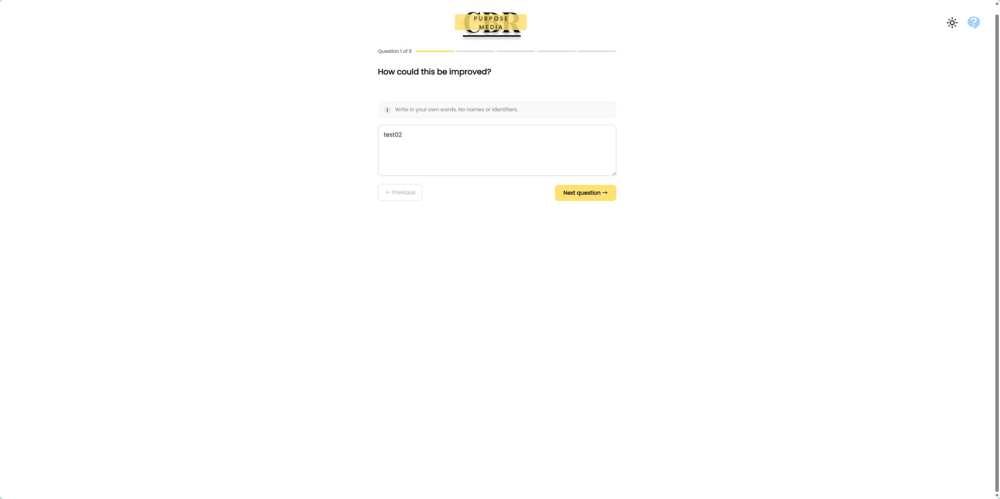
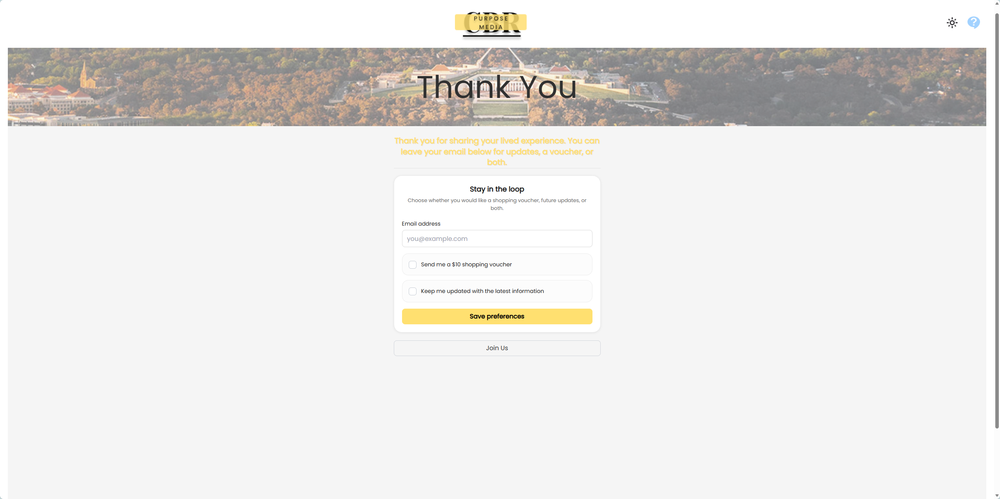
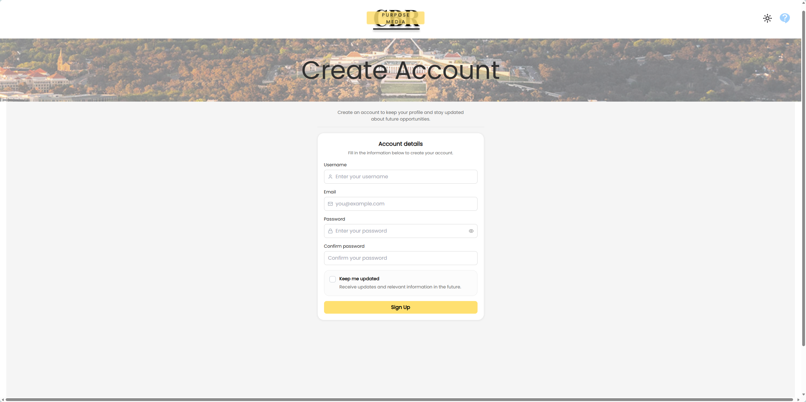

## User Guide

### 1. Introduction

This platform allows users to share their thoughts and perspectives on a given issue through a series of guided questions. The interaction is designed to be simple, intuitive, and step-by-step, making it easy to complete without prior experience.

Users will be presented with an issue and asked to respond to several questions. All responses are open-ended and based on the user’s own understanding and opinions.

------

### 2. How It Works

The process is straightforward and consists of three main steps:

- #### View the Issue

Users first see a description of an issue. They can choose their initial stance by selecting one of the available options.

- #### Answer Questions

Users are guided through a series of questions, answering them one at a time.
 They can type their responses and proceed by pressing “Next” or the Enter key.
 If unsure, users may choose to skip remaining questions.

- #### Completion and Rewards

After completing the questions, users may receive a reward, such as a discount coupon, sent to their email.

Users also have the option to register for an account. Registered users can save their profile information (e.g., selected tags), so they do not need to re-enter it in future interactions.

### 3. Get Start

Get to the main page through shared link and click the "Get Started" button.

If you agree with the consent, please confirm and continue.

Enter name and select tags best suits you. You can also create new tags if you want.

### 4. Answering the Issue

First choose your attitude to the issue.

Then answer 5 times, deeper and deeper, about why you choose it. Or select "I don't know" to end the procedure.

Then goto how part, asking about the solutions. Similarly, 5 times and you can end earlier if you really don't know how.

### 5. Submitting Answers and Getting Coupons

After you finish all the questions, we'll be really grateful to you and would like to send you a ten-dollar voucher through your email address.

### 6. Signup

You can click the "Join Us" button after finish the questionnaire or before start to signup your own account. Name and tags will be recorded so you wouldn't need to select them again when you deal with another questionnaire.

## 3. Conclusion 

The platform enables users to easily share their perspectives through a simple and structured process, while ensuring that responses remain authentic and unbiased.