# 🧭 Compass Codesign Prototype Guide

This guide provides an overview of the UI design for both the Admin and User sides of the Compass Codesign prototype.

---

## 🔑 Admin Side

This section details the design system and layouts for the administrative interface.

🔗 **View the full prototype and design flow on Figma: [Codesign - Admin Side](https://www.figma.com/design/suJKLz1E8vvZfPvlhEDYhy/Codesign-admin-side)**

### Design System (Tokens & Components)

Here are the foundational elements of the admin interface design.

* **Color Palettes:** Light, Dark, and Accent Colors
    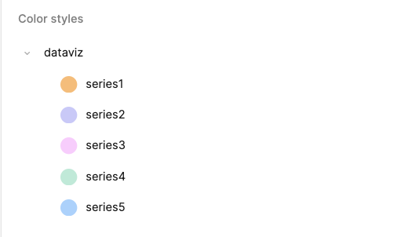
    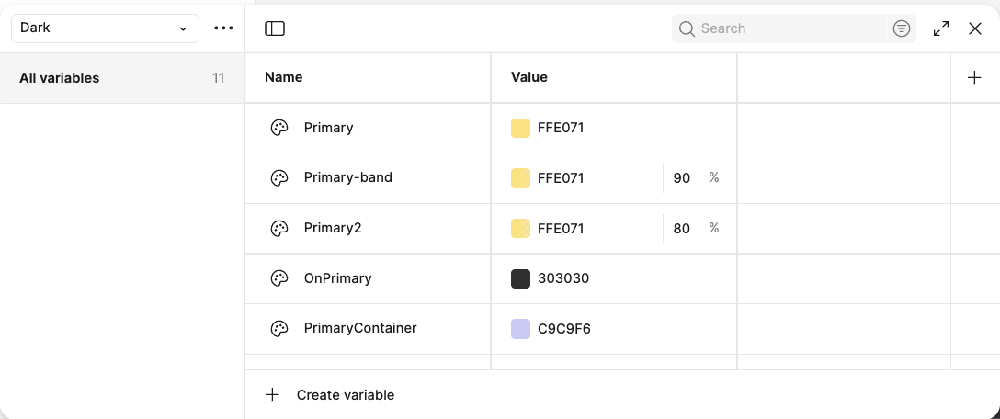
    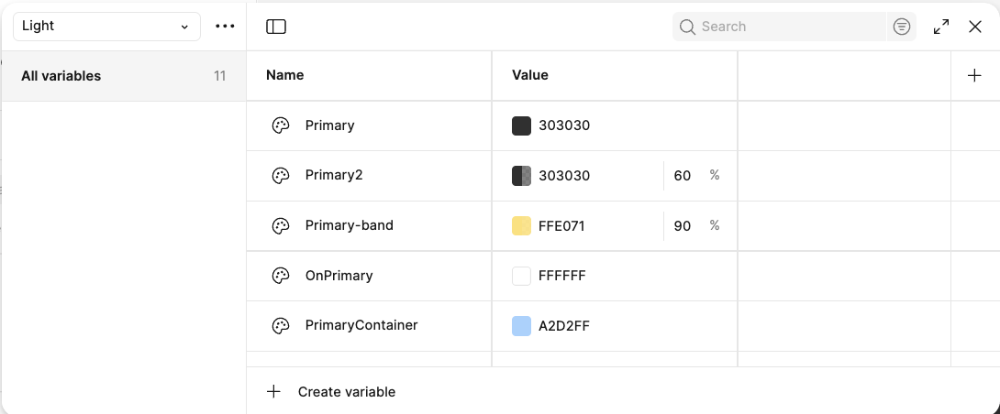
* **Core Styles:** Radius, Spacing, Elevation, and Typography
    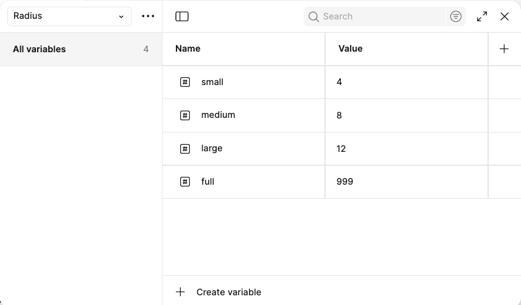
    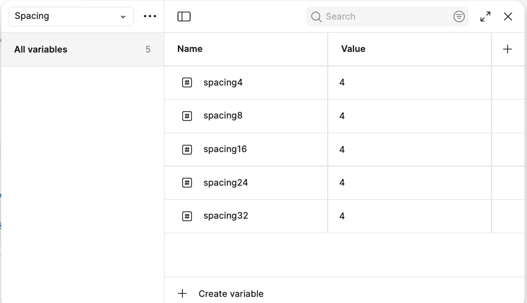
    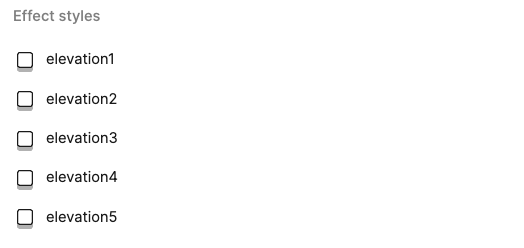
    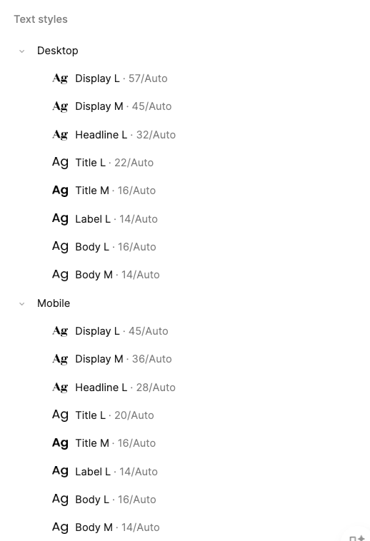
* **Components:** A collection of reusable UI elements.
    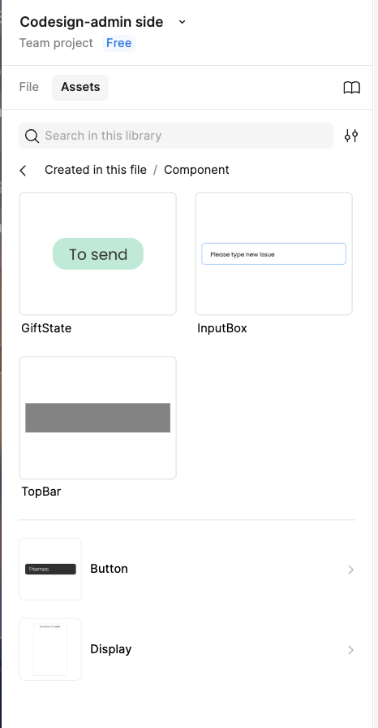

### Mobile Version

A responsive layout designed for smaller screens, available in both light and dark themes.

**☀️ Light Mode**
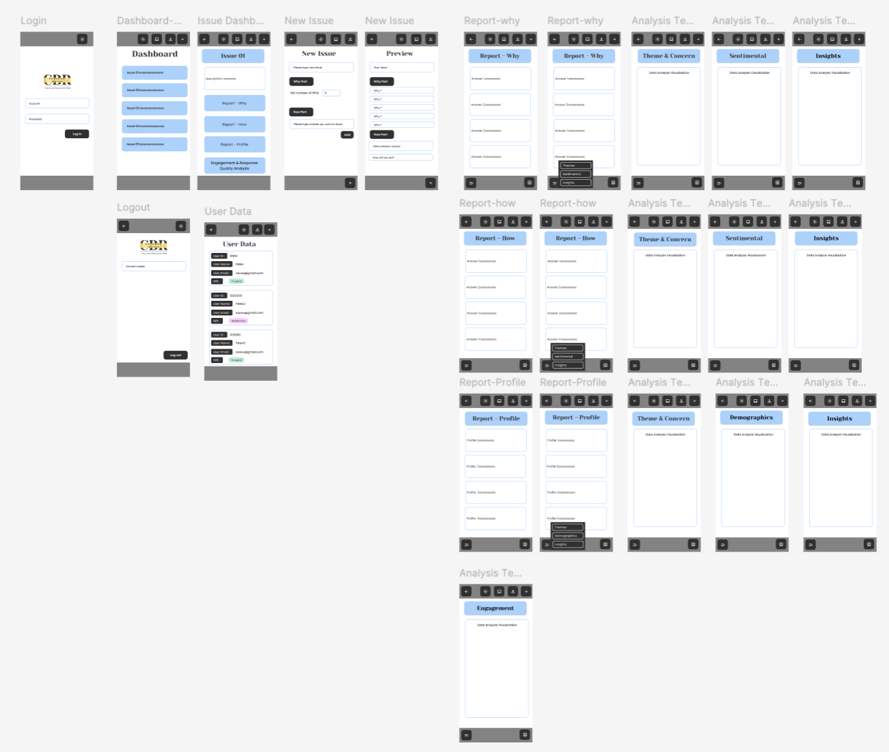

**🌙 Dark Mode**
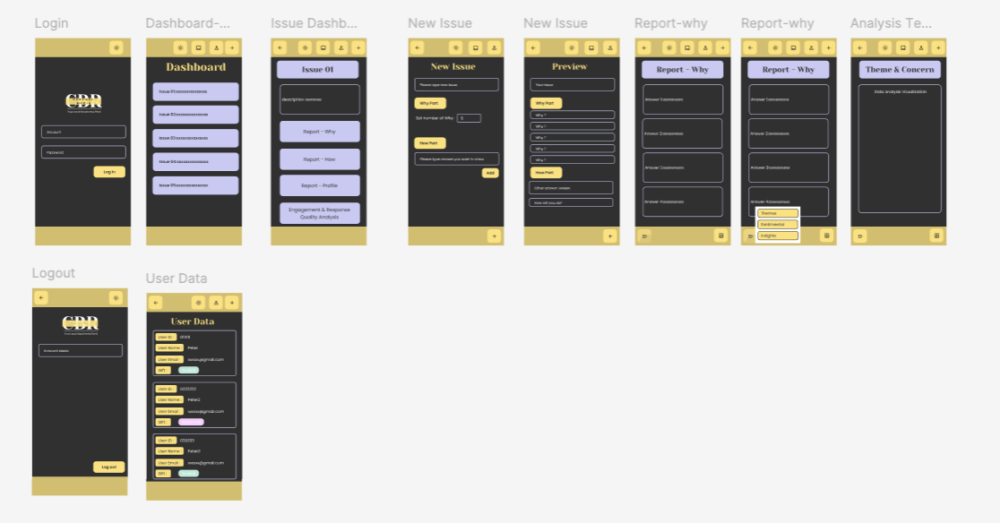

### Desktop Version

The full-featured interface for larger screens, showcasing key pages like the issue tracker and dashboard.

* **Issues Page**
    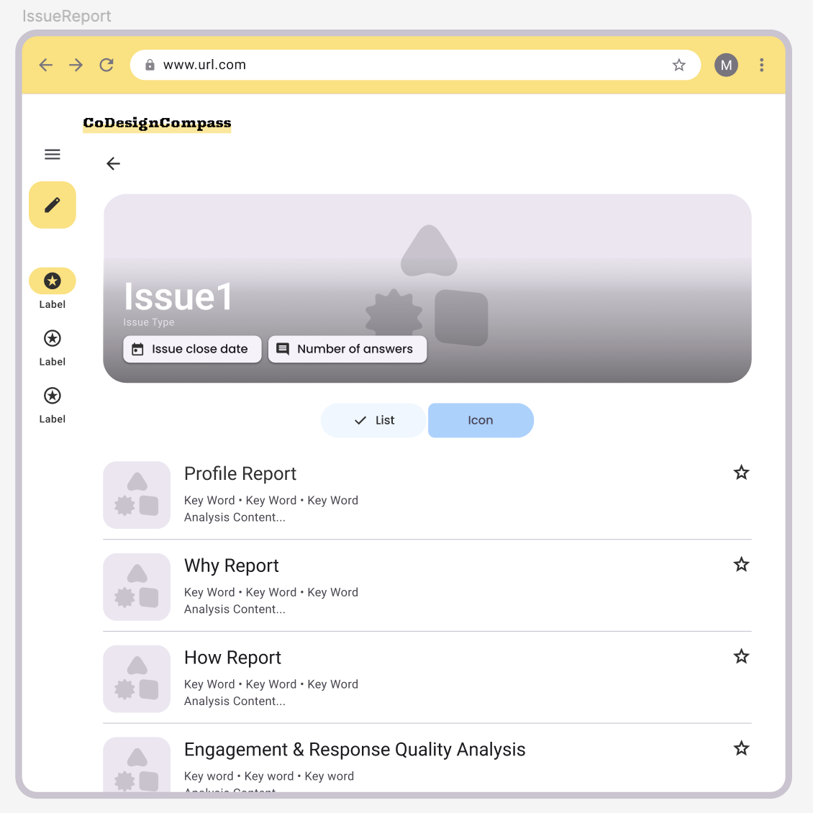
* **Dashboard**
    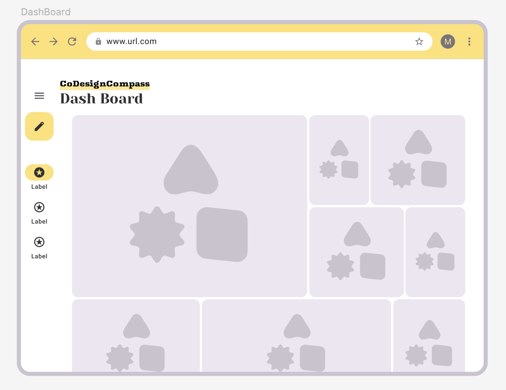

---

## 👥 User Side

This section details the design system and layouts for the public-facing user interface.

🔗 **View the full prototype and design flow on Figma: [Codesign - User Side](https://www.figma.com/design/uRo050ulyRaJAeWVkk0HEj/DashBoard-Layout)**

### Design System (Tokens & Components)

Here are the foundational elements of the user interface design.  

* **Design References & Colors:**  

    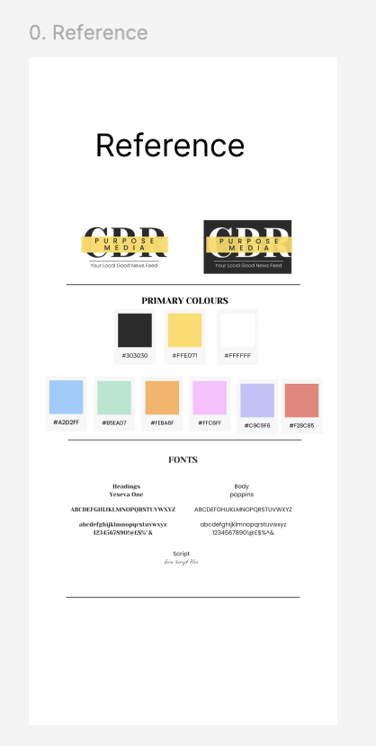
    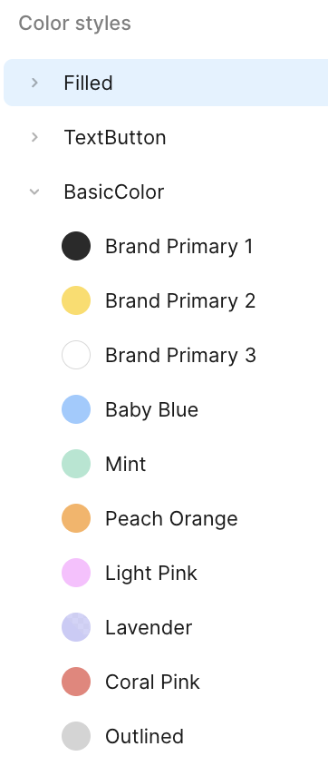
    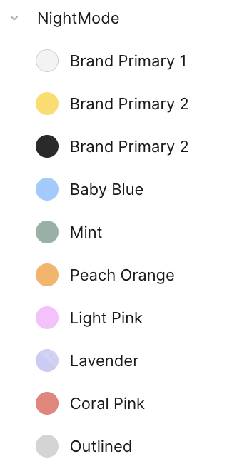

---

* **Typography:** Separate scales for mobile and desktop for optimal readability.  

    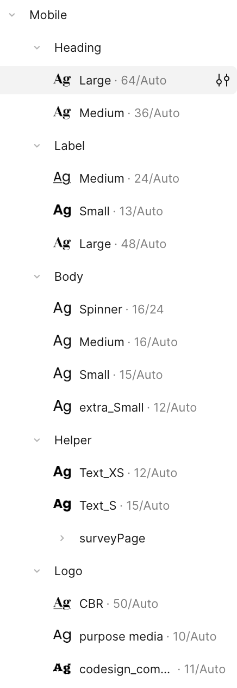
    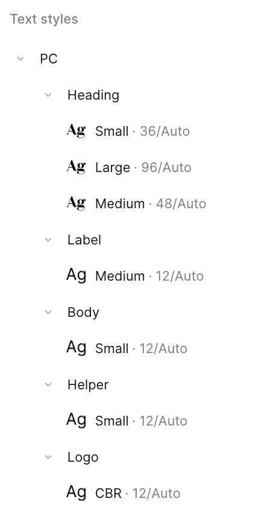  

* **Components:** A collection of reusable UI elements.  

    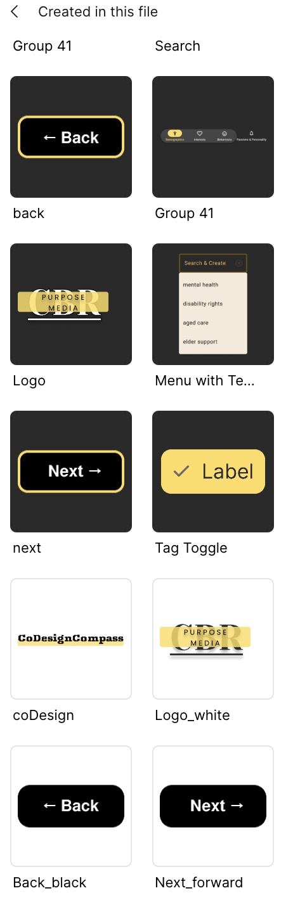  

### Mobile Version

The user-facing interface optimized for mobile devices.  

**☀️ Light Mode**
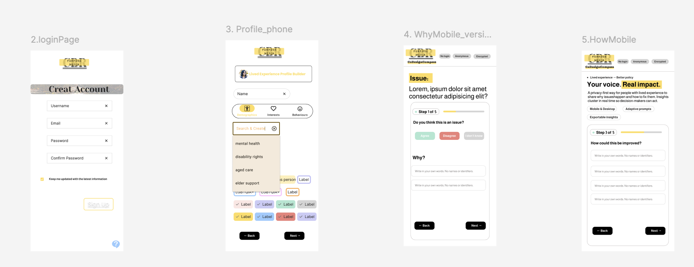

**🌙 Dark Mode**
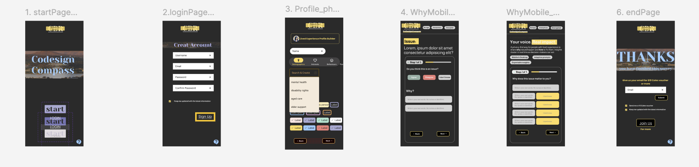

### Desktop Version

The primary user experience for desktop users.

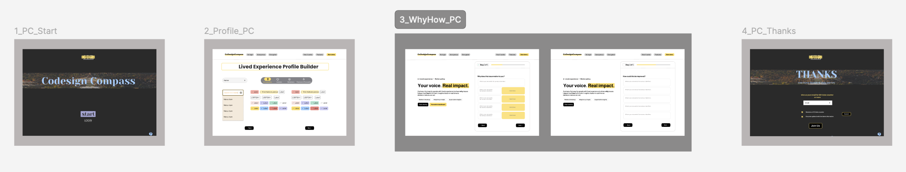

### Button States 

This section highlights additional design work focused on interaction and accessibility.  

* **Button States (MD3 Spec):**  
    - **Default** – clear, ready-to-use state  
    - **Pressed** – visual feedback on interaction  
    - **Disabled** – reduced emphasis for unavailable actions  

* **Key Buttons Examples:**  
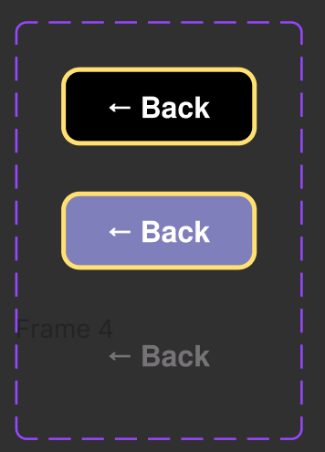
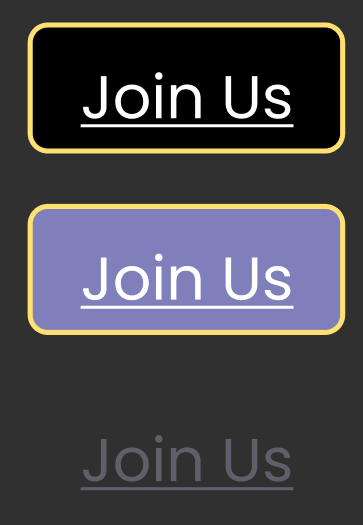
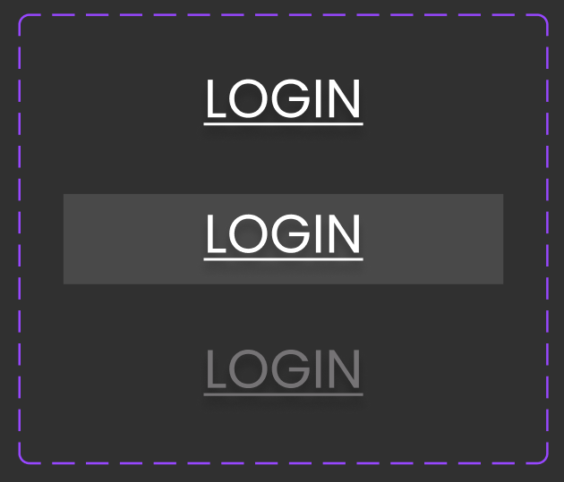
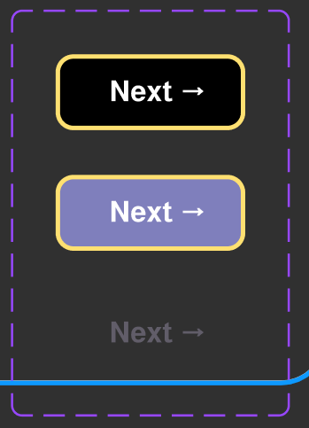
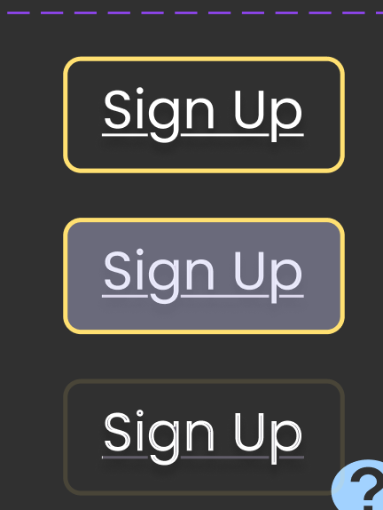
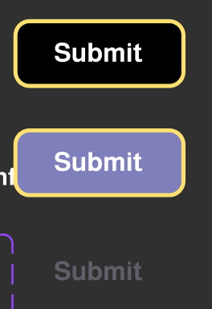
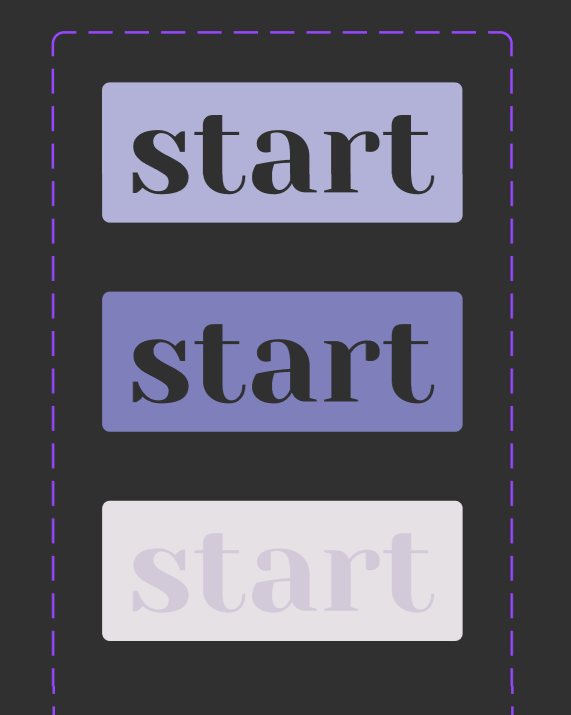

